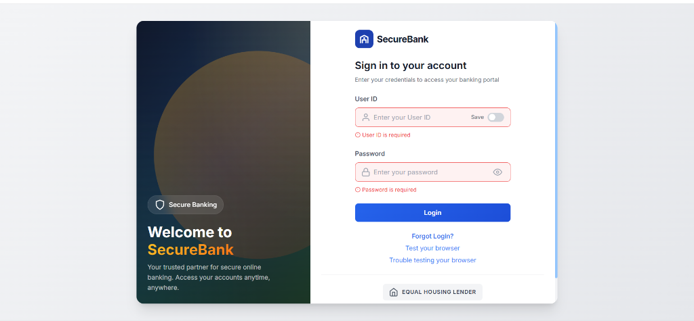
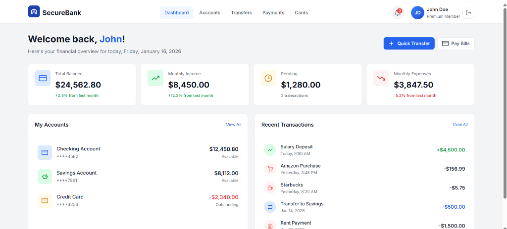

# SecureBank - Modern Login & Dashboard

A modern, responsive banking login page and dashboard built with vanilla HTML, CSS, and JavaScript. Features a professional UI design inspired by real banking applications.

## 📸 Screenshots

### Login Page


### Dashboard


## ✨ Features

- **Modern UI Design** - Clean, professional banking interface
- **Responsive Layout** - Works on desktop, tablet, and mobile
- **Form Validation** - Real-time input validation with error messages
- **Password Toggle** - Show/hide password functionality
- **Remember User ID** - Save user ID using localStorage
- **Loading States** - Smooth loading animations
- **Dashboard Overview** - Account balances, stats, and transactions

## 🔐 Demo Credentials

```
User ID: admin
Password: 123456
```

## 📁 Folder Structure

```
modern-login/
├── index.html              # Login page
├── dashboard.html          # Dashboard page
├── README.md               # Project documentation
│
├── css/
│   ├── styles.css          # Main login styles (imports components)
│   ├── dashboard.css       # Main dashboard styles (imports components)
│   │
│   ├── base/               # Shared base styles
│   │   ├── variables.css   # CSS variables (colors, spacing, fonts)
│   │   └── reset.css       # Reset and utility classes
│   │
│   ├── login/              # Login page components
│   │   ├── layout.css      # Container, form panel, logo
│   │   ├── hero.css        # Left hero panel styles
│   │   ├── form.css        # Input fields, toggles, errors
│   │   ├── buttons.css     # Sign in button, messages
│   │   └── footer.css      # Footer and responsive styles
│   │
│   └── dashboard/          # Dashboard page components
│       ├── layout.css      # Main layout, welcome section
│       ├── header.css      # Header, navigation, user menu
│       ├── stats.css       # Statistics cards
│       ├── cards.css       # Account cards
│       ├── transactions.css # Transaction list
│       └── responsive.css  # Media queries
│
├── js/
│   ├── script.js           # Login page logic
│   └── dashboard.js        # Dashboard page logic
│
└── images/
    ├── login-page.png      # Login screenshot
    └── dashboard-page.png  # Dashboard screenshot
```

## 🛠️ Technologies Used

- **HTML5** - Semantic markup
- **CSS3** - Modern styling with CSS variables, Flexbox, Grid
- **JavaScript** - Vanilla JS (no frameworks)
- **Google Fonts** - Inter font family

## 🚀 Getting Started

1. Clone the repository:
   ```bash
   git clone https://github.com/amananurag20/modern-login.git
   ```

2. Open `index.html` in your browser

3. Login with demo credentials:
   - User ID: `admin`
   - Password: `123456`

## 📱 Responsive Design

The application is fully responsive and works on:
- Desktop (1200px+)
- Tablet (768px - 1199px)
- Mobile (< 768px)

## 🎨 Color Palette

| Color | Hex | Usage |
|-------|-----|-------|
| Primary Blue | `#2563eb` | Buttons, links, accents |
| Success Green | `#22c55e` | Success states, income |
| Error Red | `#ef4444` | Error states, expenses |
| Warning Orange | `#f59e0b` | Warning states, pending |
| Gray | `#6b7280` | Text, borders |

## 📄 License

This project is open source and available under the [MIT License](LICENSE).

---

Made with ❤️ by Aman Anurag
